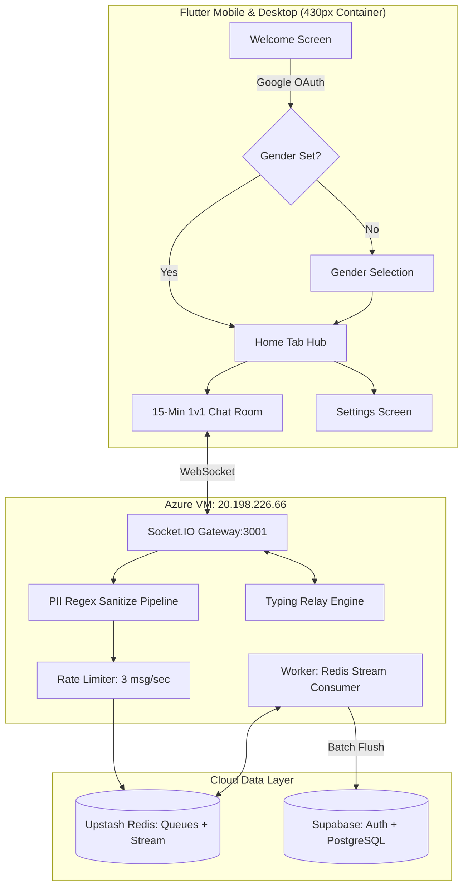

# Benchly — Master Architecture & Project Plan

> **Campus Anonymous Conversations for East West University**  
> *"No names. No profiles. Just talk. Vanish after 15 minutes."*  
> **App Name:** Benchly  
> **Package:** `com.rxxeron.benchly`  
> **Repository:** [https://github.com/rxxeron/benchly](https://github.com/rxxeron/benchly)

---

## 1. Live Production Deployment (Azure Cloud)

The backend and async stream worker are deployed and running 24/7 on an Azure Linux VM.

| Component | Provider / Infrastructure | Details |
|---|---|---|
| **Virtual Machine** | Azure Virtual Machine (`Standard_B1s`) | Ubuntu Server 24.04 LTS (x64) |
| **Region** | Southeast Asia (Singapore) | Lowest ping to Bangladesh |
| **Public IP** | `20.198.226.66` | Port `3001` (TCP Inbound Allowed) |
| **Runtime** | Node.js `v22.20.2` | Global native WebSocket enabled |
| **Process Manager** | PM2 | `benchly-server` (PID 0) & `benchly-worker` (PID 1) |
| **Database & Auth** | Supabase (PostgreSQL) | JWT Auth, RLS policies, trigger-based alias generator |
| **Cache & Queue** | Upstash Redis (Valkey) | Matchmaking queues, rate-limiting, message streams |

### Useful Server Management Commands (SSH)
Connect via SSH:
```bash
ssh rxxeron@20.198.226.66
```

Manage background services:
```bash
pm2 status                       # Check service health
pm2 logs benchly-server          # View real-time server logs
pm2 logs benchly-worker          # View stream persister logs
pm2 restart all                  # Restart all services after code updates
```

Pull new updates to the server:
```bash
cd ~/benchly
git pull origin main
cd backend
npm install && npm run build
pm2 restart all
```

---

## 2. Core Architecture Overview



---

## 3. V1 Features (Fully Implemented & Shipped)

### 3.1 Authentication & Gatekeeping
- **Google OAuth Only:** Direct Google Sign-In with university domain enforcement.
- **Strict Email Pattern:** `^[0-9]{4}-[0-9]-[0-9]{2}-[0-9]{3}@std\.ewubd\.edu$`
- **Developer Bypass:** `rhrakibulhasan279@gmail.com` and `rhrakibulhasan127@gmail.com` bypassed in database triggers for testing.
- **Gender Onboarding:** Mandatory prompt on first sign-in (Male/Female). Lowercase constrained in database (`gender IN ('male', 'female', 'other')`).

### 3.2 1v1 Chat Experience
- **15-Minute Session Limit:** Fixed 15-minute countdown clock with amber alert at 60 seconds.
- **Auto-Termination:** Closes room automatically at 0:00 and triggers 30-minute user cooldown.
- **Mutual Extension:** Both users can vote to extend (+15 minutes). Server clears old timeouts and extends session.
- **Real-Time Typing Indicators:** Animated dots show *"typing..."* when partner is active.
- **Strict PII Censorship:**
  - Phone numbers (`+8801X...` or `01X...`) $\rightarrow$ `[CENSORED PHONE]`
  - Emails $\rightarrow$ `[CENSORED EMAIL]`
  - Links / URLs $\rightarrow$ `[CENSORED LINK]`
  - Social handles (Facebook, IG, Snapchat, WhatsApp, Telegram) $\rightarrow$ `[CENSORED SOCIAL]`
- **Report & End Chat Menu:**
  - In-chat bottom sheet with structured report categories (Harassment, Personal Info, Inappropriate, Spam).
  - Reports inserted directly into `public.reports` table.
  - End Chat confirmation modal allowing early exit.

### 3.3 Alias System & Cooldown Rules
- **Initial Alias:** Generated automatically upon sign-up (Adjective + Noun + Number).
- **1st Alias Change:** Can be changed **anytime with zero waiting period** (`Change (Free)`).
- **Subsequent Changes:** Requires a **30-day cooldown interval** between changes.
- Tracked via `alias_change_count` and `alias_changed_at` columns on `public.users`.

### 3.4 Home Hub & Navigation
- **5-Tab Navigation:** Chat, Alerts (Placeholder), Feed (Placeholder), Shop (Placeholder), Settings.
- **Match Preference Chips:** Match with `Anyone`, `Guys`, or `Girls`.
- **Responsive Desktop Framing:** Max-width 430px mobile shell on desktop web with ambient dark border.
- **Settings Screen:** Change gender, age range (`18-19`, `20-21`, `22-23`, `24+`), regenerate alias, view app version, and Log Out.

---

## 4. Database Schema Reference

### `public.users`
| Column | Type | Default | Description |
|---|---|---|---|
| `id` | `UUID` | Primary Key | References `auth.users(id)` |
| `email` | `TEXT` | NOT NULL | Student email |
| `generated_alias` | `TEXT` | NOT NULL | Public pseudonym |
| `gender` | `TEXT` | NULL | `'male'`, `'female'`, `'other'` |
| `alias_change_count` | `INT` | `0` | Number of times alias has been changed |
| `alias_changed_at` | `TIMESTAMPTZ` | NULL | Timestamp of last manual alias change |
| `age_range` | `TEXT` | NULL | `'18-19'`, `'20-21'`, `'22-23'`, `'24+'` |
| `match_preference` | `TEXT` | `'anyone'` | `'anyone'`, `'male'`, `'female'` |
| `streak_count` | `INT` | `0` | Consecutive days active |
| `stones_balance` | `INT` | `10` | In-app engagement currency |
| `total_chats` | `INT` | `0` | Total completed conversations |

### `public.messages`
| Column | Type | Default | Description |
|---|---|---|---|
| `id` | `UUID` | `uuid_generate_v4()` | Message ID |
| `room_id` | `UUID` | NOT NULL | Chat session identifier |
| `author_id` | `UUID` | References users | Hidden from clients; batch written by worker |
| `content` | `TEXT` | NOT NULL | Sanitized message content |
| `created_at` | `TIMESTAMPTZ` | `NOW()` | Timestamp |

### `public.reports`
| Column | Type | Default | Description |
|---|---|---|---|
| `id` | `UUID` | `uuid_generate_v4()` | Report ID |
| `reporter_id` | `UUID` | References users | User submitting report |
| `reported_message_id` | `UUID` | References messages | Optional target message |
| `reason` | `TEXT` | NOT NULL | Abuse reason |
| `resolved` | `BOOLEAN` | `FALSE` | Resolution status |

---

## 5. V2 Roadmap (Future Expansion)

### Phase 2.1: Stones 💎 Economy
- **Earn:** Daily login (+2 💎), 5-chat milestone (+5 💎), 7-day streak (+10 💎).
- **Spend:** Mid-chat gender reveal (-3 💎), chat extension (-2 💎).
- **Ledger:** New `transactions` table auditing all stone flows.

### Phase 2.2: Avatar System & Shop Tab
- Custom pixel/vector avatar sets (Backbencher, Topper, Campus Cat, Night Owl, Cyber Phantom).
- Unlockable via stones balance.
- Displayed on profile card and chat room header.

### Phase 2.3: BenchLipi (Anonymous Campus Feed)
- Anonymous public confession / shoutout board.
- Personalized shareable link: `benchly.app/@alias` for receiving anonymous letters.
- Heart reactions and threaded anonymous comments.
- Stone-powered 1-hour post boost.

### Phase 2.4: Group Haunts
- 5-person topic-based anonymous chat rooms.
- User-created topics or campus lounge rooms (Exam Cram, Canteen Adda, Tech Talk).

---

## 6. Local Development & Build Runbook

### Run Flutter Client with Remote Azure Backend:
```powershell
cd G:\Backbench\frontend
C:\flutter\bin\flutter.bat run -d chrome
# Or to override URL dynamically:
C:\flutter\bin\flutter.bat run -d chrome --dart-define=SOCKET_URL=http://20.198.226.66:3001
```

### Run Flutter Analysis:
```powershell
C:\flutter\bin\flutter.bat analyze
```

### Build Android Release APK:
```powershell
cd G:\Backbench\frontend
C:\flutter\bin\flutter.bat build apk --release
```
Output path: `frontend/build/app/outputs/flutter-apk/app-release.apk`
